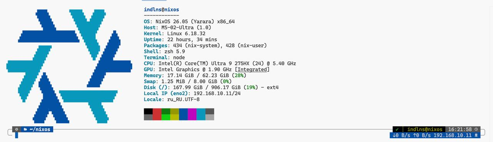

# NixOS



# 🧩 NixOS Flake Configuration

Модульная конфигурация NixOS + Home Manager, разделённая на system и home уровни.

---

## 📁 Структура проекта

```
.
├── flake.nix
├── flake.lock
├── hosts/
│   │── ms-02/
│   │    ├── configuration.nix
│   │    └── hardware-configuration.nix
│   │
│   └── n10-nixos/
│       ├── configuration.nix
│       └── hardware-configuration.nix
│
├── home/
│   └── indlns.nix
│
├── modules/
│   ├── system/
│   │   ├── core/
│   │   ├── networking/
│   │   ├── hardware/
│   │   ├── virtualization/
│   │   ├── services/
│   │   │   ├── ai/
│   │   │   ├── audio/
│   │   │   ├── desktop/
│   │   │   └── network/
│   │   ├── security/
│   │   └── maintenance/
│   │   └── default.nix
│   │
│   └── user/
│       ├── cli/
│       ├── shell/
│       └── bundle.nix
│
└── secrets/
```

---

## ⚙️ Сборка

## Клонируем репозиторий
```bash
git clone https://app.git.indlns.ru/nixos/nixos.git
cd nixos
```

### MS-02
```bash
sudo nixos-rebuild switch --flake .#ms-02
```

### N10-NixOS
```bash
sudo nixos-rebuild switch --flake .#n10-nixos
```

---

## 🧠 Архитектура

### system/
- core системы
- сеть
- безопасность
- железо
- сервисы

### home/
- shell
- CLI
- git
- user config

---

## 🔐 Secrets
SOPS secrets:
- secrets/common.yaml
- modules/system/security/sops.nix

---

## 🖥 Hosts
- hosts/ms-02 — основная система
- hosts/n10-nixos — виртуальная машина

---

## 🚀 Идея
- модульность
- разделение system/home
- масштабируемость multi-host