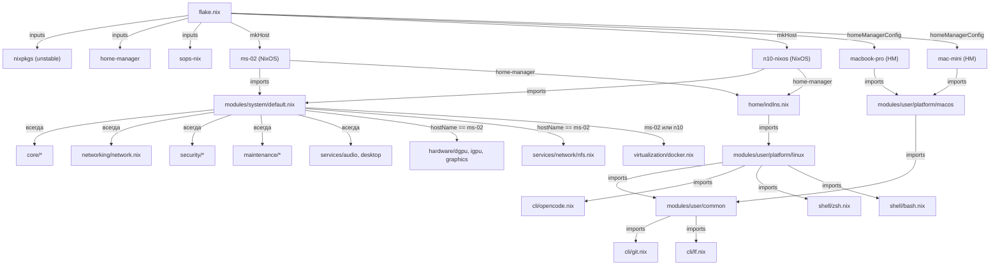

# Архитектура проекта

Этот репозиторий — **NixOS Flake**, управляющий конфигурациями NixOS (два хоста) и Home-Manager (два macOS). Цель — инфраструктура как код, переиспользование модулей, простое добавление новых хостов.

## Структура репозитория

```text
├─ flake.nix                         # Точка входа — определяет inputs и outputs
├─ flake.lock                        # Закреплённые версии зависимостей
├─ opencode.json                     # Конфигурация OpenCode
├─ README.md                         # Общие инструкции
├─ modules/                          # Переиспользуемые NixOS-модули
│   ├─ system/                       # Системные (ядро, сеть, сервисы)
│   │  ├─ core/                      # Базовые: nix, locale, shell, swap, users
│   │  ├─ networking/                # Сеть и файрвол
│   │  ├─ hardware/                  # GPU, графика
│   │  ├─ virtualization/            # Docker
│   │  ├─ services/                  # Сервисы: AI, audio, desktop, network
│   │  ├─ security/                  # SOPS, SSH, секреты
│   │  ├─ maintenance/               # Очистка, cron
│   │  └─ default.nix                # Сборщик всех системных модулей
│   └─ user/                         # Пользовательские
│       ├─ common/                   # Общее (git, lf)
│       ├─ cli/                      # CLI-утилиты
│       ├─ shell/                    # Оболочки (zsh, bash)
│       └─ platform/                 # Платформы (macos, linux)
├─ hosts/                            # Конфигурации хостов
│   ├─ ms-02/                        # NixOS (физический сервер)
│   ├─ n10-nixos/                    # NixOS (виртуальная машина)
│   ├─ macbook-pro/                  # Home-Manager (macOS)
│   └─ mac-mini/                     # Home-Manager (macOS)
├─ home/                             # Общие Home-Manager фрагменты
│   └─ indlns.nix                    # Конфигурация для пользователя indlns (Linux)
├─ docs/                             # Документация
└─ secrets/                          # SOPS зашифрованные данные
    ├─ common.yaml                   # Общие секреты
    └─ .sops.yaml                    # Конфигурация SOPS
```

## Внешние зависимости (inputs)

| Input | Источник | Назначение |
|-------|----------|------------|
| `nixpkgs` | `github:nixos/nixpkgs/nixos-unstable` | Репозиторий пакетов |
| `home-manager` | `github:nix-community/home-manager/release-26.05` | Управление пользовательским окружением |
| `sops-nix` | `github:Mic92/sops-nix` | Управление секретами через SOPS |

## Ключевые концепции

| Концепция | Описание | Где используется |
|-----------|----------|------------------|
| **Flake** | Точка входа, определяющая inputs и outputs (конфигурации хостов). | `flake.nix` |
| **mkHost** | Хелпер-функция, собирающая конфигурацию NixOS-хоста из path + модулей. | `flake.nix` → `nixosConfigurations` |
| **Модули** | Композитные Nix-фрагменты, добавляющие или изменяющие свойства системы. | `modules/system/`, `modules/user/` |
| **Хосты** | Каталог в `hosts/` с `configuration.nix` для каждой машины. `hardware-configuration.nix` не редактируется. | `hosts/<host>/` |
| **Home-Manager** | Пользовательская конфигурация (shell, CLI, пакеты). На macOS — отдельный flake output, на NixOS — встроен через `home-manager.nixosModules`. | `hosts/<mac>/home.nix`, `home/indlns.nix` |
| **SOPS** | Шифрование секретов (GPG/Age). Репозиторий хранит только зашифрованные данные. | `secrets/`, `modules/system/security/sops.nix` |

## Функция `mkHost`

```nix
mkHost = name: path:
  nixpkgs.lib.nixosSystem {
    inherit system;
    specialArgs = { inherit inputs; hostName = name; };
    modules = [
      path                              # configuration.nix хоста
      sops-nix.nixosModules.sops       # Поддержка SOPS
      home-manager.nixosModules.home-manager  # Home-Manager внутри NixOS
      {
        home-manager.useGlobalPkgs = true;
        home-manager.useUserPackages = true;
        home-manager.users.indlns = import ./home/indlns.nix;
      }
    ];
  };
```

**Параметры:**
- `name` — имя хоста (передаётся как `hostName` в модули через `specialArgs`)
- `path` — путь к `configuration.nix`

## Mermaid-диаграмма



## Дерево зависимостей системных модулей

```text
modules/system/default.nix
├── core/input.nix
├── core/locale.nix
├── core/nix.nix
├── core/nixpkgs.nix
├── core/packages.nix
├── core/shell.nix
├── core/swap.nix
├── core/users.nix
├── maintenance/cleanup.nix
├── maintenance/cron.nix
├── networking/network.nix
├── security/secrets.nix
├── security/sops.nix
├── security/ssh.nix
├── services/audio/pipewire.nix
├── services/desktop/desktop.nix
├── services/desktop/firefox.nix
├── services/desktop/input.nix
│
│  # Только для ms-02:
├── hardware/graphics.nix
├── hardware/igpu.nix
├── hardware/dgpu.nix
├── services/network/nfs.nix
│
│  # Только для ms-02 и n10-nixos:
└── virtualization/docker.nix
```

## Добавление нового хоста

1. Создать каталог `hosts/<имя>/`.
2. Сгенерировать `hardware-configuration.nix`: `nixos-generate-config --root /mnt/<имя>`.
3. Написать минимальный `configuration.nix` с импортом `modules/system/default.nix`.
4. В `flake.nix` добавить: `nixosConfigurations.<имя> = mkHost "<имя>" ./hosts/<имя>/configuration.nix;`
5. Проверить: `sudo nixos-rebuild switch --flake .#<имя>`.

## Добавление нового системного модуля

1. Создать файл `modules/system/<категория>/<имя>.nix`.
2. Определить модуль как функцию: `{ config, pkgs, ... }: { ... }`.
3. Добавить импорт в `modules/system/default.nix` (условно или безусловно).
4. Проверить: `sudo nixos-rebuild test --flake .#<хост>`.

## Редактирование пользовательских фрагментов

Все файлы `modules/user/` автоматически подключаются через Home-Manager. При изменении:
1. Отредактировать соответствующий файл.
2. Запустить `sudo nixos-rebuild switch --flake .#<хост>` (NixOS) или `home-manager switch --flake .#<хост>` (macOS).
3. Проверить результат: `ls ~/.zshrc`, `zsh --version` и т.д.
