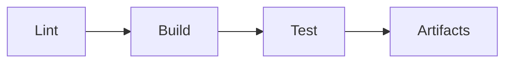

# CI/CD

## Обзор

Сборка и тестирование проекта выполняются через GitHub Actions. Конфигурация: `.github/workflows/ci.yml`.

## Этапы пайплайна



| Этап | Описание | Команда |
|------|----------|---------|
| **Lint** | Проверка Markdown и Nix | `markdownlint docs/**/*.md`, `deadnix`, `nix flake check` |
| **Build** | Сборка образов для каждого хоста | `nix build .#<host>` |
| **Test** | Unit, integration и e2e тесты | `nix flake check`, `nixos-rebuild test` |
| **Artifacts** | Публикация образов и отчётов | `actions/upload-artifact` |

## Матрица хостов

```yaml
strategy:
  matrix:
    host: [ ms-02, n10-nixos, macbook-pro, mac-mini ]
```

## Добавление нового хоста в CI

1. Добавить имя хоста в `matrix.hosts` в `.github/workflows/ci.yml`
2. Создать тесты для нового хоста (если нужны специфичные)
3. Проверить локально: `nix build .#<новый-хост>`

## Локальный запуск

```bash
# Сборка конкретного хоста
nix build .#ms-02

# Проверка всех конфигураций
nix flake check .

# Тестирование (без переключения)
sudo nixos-rebuild test --flake .#ms-02
```

## Просмотр логов

Логи CI доступны в:
```
https://github.com/<org>/<repo>/actions/runs/<run-id>
```

## Типичные ошибки CI

| Ошибка | Причина | Решение |
|--------|---------|---------|
| `attribute missing` | Не найден пакет или модуль | Проверить пути в `imports` |
| `SOPS key not found` | Отсутствует Age-ключ | Импортировать ключ |
| `Timeout` | Долгая сборка | Разбить на меньшие шаги |
